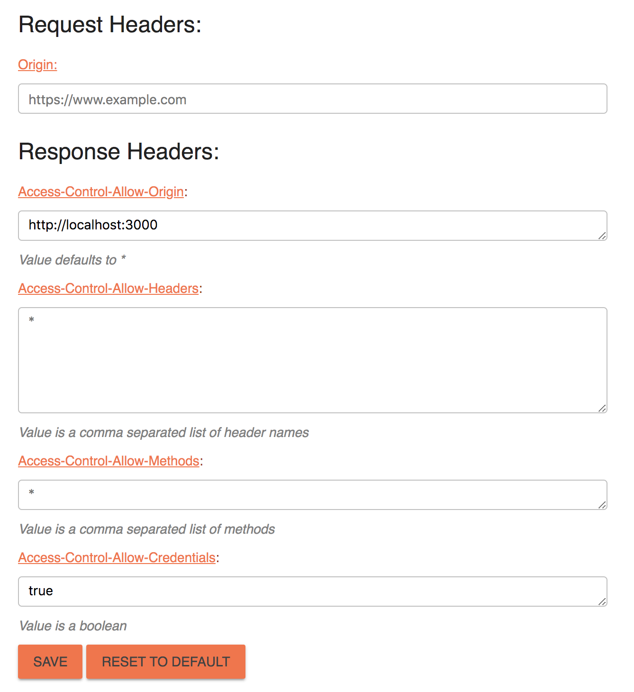

# To get this working on localhost:3000

1. Install [this chrome extension](https://chrome.google.com/webstore/detail/moesif-origin-cors-change/digfbfaphojjndkpccljibejjbppifbc)
2. Enter these settings:
   

3. Run `npm start`

4. To do: get images from google then add to img src, get yelp api request working on express server, save yelp api results to mongo db, user accounts, oath...
